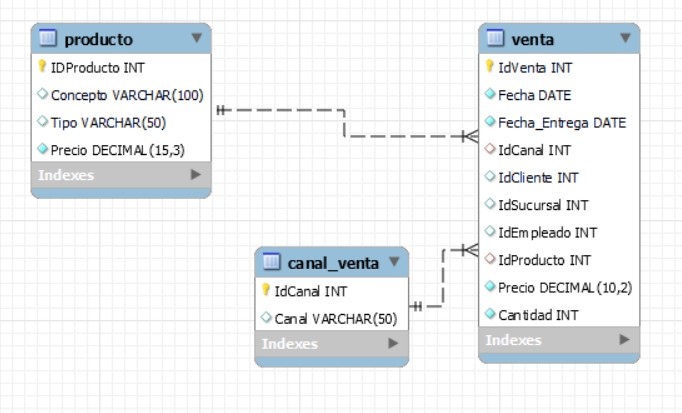

# Checkpoint - Módulo 2

Cómo responder: <br>
* Cuando se pida una respuesta numérica y tenga decimales, redondear al segundo decimal (Recordar que el 5 redondea para arriba). <br>
   Ejemplo: 1.3421 -> 1.34<br>
            1.8888 -> 1.89<br>
            1.855 -> 1.86<br>

## Responder Verdadero o Falso

### 1) Todas las métricas no son KPIs, pero todos los KPIs están basados en métricas.
<br>

# 1. VERDADERO
## Elegir la opción correcta

### 2) ¿Cuál es el KPI a utilizar si quisiera saber si a un cliente se lo puede considerar "muy bueno" en relación al gasto que realiza en mi negocio desde que es cliente?
a - LTV<br>
b - CAC<br>
c - Conversion rate<br>
d - Churn rate<br>
<br>

# 2.LTV

### 3) Recientemente Netflix realizó un cambio en sus planes, porque detectaron que muchos subscriptores se estaban dando de baja, de acuerdo a los KPIs vistos, ¿Cuál sería el que habría que utilizar para llegar a esa conclusión?

a - LTV<br>
b - CAC<br>
c - Conversion rate<br>
d - Churn rate<br>
<br>

# 3. Churn rate

### 4) El espacio muestral es:
a - Una tabla con las distintas funciones de probabilidad.<br>
b - El conjunto de todos los resultados posibles de un experimento.<br>
c - Un evento que puede describirse con una característica única.<br>
<br>

# 4. El conjunto de todos los resultados

## Responder Verdadero o Falso

### 5) Dos sucesos excluyentes pueden ser compatibles:
<br>

# 5. FALSO

## Resuelve los siguientes ejercicios:

## En tu motor de base de datos MySQL, ejecutá las instrucciones del script 'Checkpoint_Create_Insert.sql' (Si no trabajas con MySQL es posible que tengas que realizar algunos ajustes en el script. También están provistas las tablas en formato csv dentro de la carpeta 'tablas_cp').
Se crearan 3 tablas:<br>
* venta:
* canal_venta
* producto



## Contestar las siguientes preguntas, utilizando el DER y mysql:

### 6) ¿Cuál es el id del Producto cuyo nombre/concepto es PARLANTE JBL GO ORANGE BLUETOOTH? 
<br>


```sql
SELECT IDProducto, Concepto
FROM producto
WHERE Concepto = 'PARLANTE JBL GO ORANGE BLUETOOTH';
```

# 6. 42835

### 7) ¿Cuál es el promedio de precio de los productos cuyo concepto comienza con la letra C?
## Pista: acordate de las funciones de agregacion AVG/SUM/MIN/MAX/COUNT
<br>

```sql
SELECT ROUND(AVG(Precio), 2)
FROM producto
WHERE Concepto LIKE 'C%';
```

# 7. 555.75

### 8) Cual fue el mes (Fecha = Fecha de Venta) con menor venta (Venta = Precio*Cantidad) de la sucursal 13 para el año 2015 ?
## Pista para agrupar por mes podes usar el DATE_FORMAT( date,'%Y%m') --> YYYYMM o  DATE_FORMAT( date,'%m') --> MM 
a - 9<br>
b - 3<br>
c - 12<br>
d - 6<br>
e - 8<br>
<br>

```sql
SELECT DATE_FORMAT(Fecha, '%m') AS mes,
SUM(Precio * Cantidad) AS Ventas
FROM venta
WHERE IDSucursal = 13 AND DATE_FORMAT(Fecha, '%Y') = 2015
GROUP BY mes
ORDER BY venta ASC
LIMIT 1;
```

# 8. d) mes 6

## 9) ¿Cuál fue el canal de venta con mayores ventas registradas en el año 2017?
a - Telefónica<br>
b - OnLine<br>
c - Presencial<br>
<br>

```sql
SELECT cv.Canal, SUM(v.Cantidad) AS TotalVentas
FROM venta v
JOIN canal_venta cv
ON v.IdCanal
WHERE YEAR(v.Fecha) = 2017
GROUP BY cv.IdCanal
ORDER BY TotalVentas DESC
LIMIT 1;
```

# 9. OnLine con 5340 ventas

## 10) La dirección quiere motivar a los empleados con bajo rendimiento en ventas, ¿Cuál es el Id del empleado que menor cantidad de productos vendió en el histórico de ventas de la empresa?

```sql
SELECT IdEmpleado, SUM(Cantidad) AS TotalVentas
FROM venta
GROUP BY IdEmpleado
ORDER BY TotalVentas
LIMIT 1;
```

# 10. El id del empleado es 1723 con un total de 12. respuesta "c"

a - 3603<br>
b - 3504<br>
c - 1723<br>
d - 3186<br>
e - 2557<br>


### 11) Se define el tiempo de entrega como el tiempo en días transcurrido entre que se realiza la compra y se efectua la entrega. Para realizar mejoras la dirección desea saber cuál es el año (expresado con cuatro dígitos), con el promedio más alto de este tiempo de entrega. (Fecha = Fecha de venta; Fecha_Entrega = Fecha de entrega)
## Pista: acordate de las funciones de agregacion AVG/SUM/MIN/MAX
<br>

### 12) La dirección desea saber que tipo de producto tiene la segunda mayor venta en 2018 (Tabla 'producto', campo Tipo = Tipo de producto).
## Pista: acordate de las funciones de agregacion AVG/SUM/MIN/MAX
a - INFORMATICA<br>
b - ESTUCHERIA<br>
c - AUDIO<br>
d - IMPRESIÓN<br>
e - GABINETES<br>
f - GRABACION<br>
g - BASES<br>
h - GAMING<br>
<br>

## 13) ¿Cuantos productos tienen la palabra CD en alguna parte de su descripción (Concepto = Descripción del Producto) y su precio es mayor a 500? 


## Las respuestas sobre probabilidades se deben expresar entre 0 y 1, y con el criterio ya mencionado de redondeo a dos decimales.
## Ej: no 25%, sino 0.25

### 14) Dado un mazo de cartas de la baraja francesa, conocida como de poker, ¿Cuál es la probabilidad de sacar un par de ases, si me dan 5 cartas seguidas?
<br>

# 14. 0.05

### 15) Si se colocan 4 canicas blancas y 4 canicas negras dentro de un frasco y luego, de manera aleatoria se quitan 2 seguidas ¿Cuál es la probabilidad de que ambas sean de un mismo color?
<br>

# 15. 0.21

### 16) En el popular juego de dados Craps, que se juega en los casinos, se arrojan dos dados en cada tiro. Sacar un doble as se lo conoce como snake eyes. ¿Cuál es la probabilidad de sacar un doble as (1 y 1) o un 4 y 5 (en ese orden), en un tiro de los dados?
<br>

# 16. 0.06

### 17) En una cola en el banco, llaman en promedio 2 personas cada 8 minutos. ¿Cuál es la probabilidad de que en esos 8 minutos llamen a más de 1 persona?
<br>

# 17. 0.6

### 18) Acabo de llegar al casino, y en la mesa de ruleta clásica (37 números, 0-36) acaba de salir el 3. ¿Cuál es la probabilidad de que se repita este número, saliendo en el próximo tiro?
<br>

# 18. 0.03
